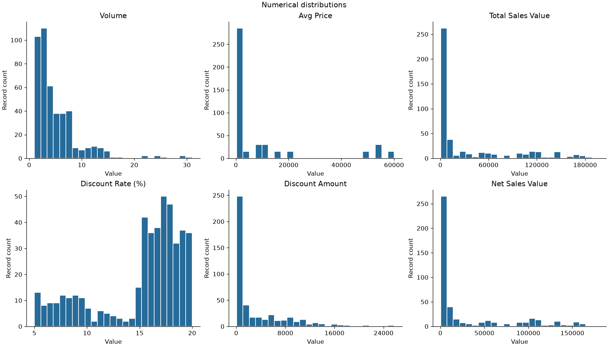

# Sales statistics and preprocessing

[Read the completed notebook](notebooks/sales_statistics.ipynb).

## Findings

The dataset contains 450 records, 30 products, and 15 dates. Most numeric measures are right-skewed; discount rate is left-skewed. Mean net sales per record is 30,466.34 in source units, versus a median of 4,677.79. City is constant and all business units have equal record counts, which should not be confused with equal revenue.

The solution computes means, medians, all informative modes, sample standard deviations, IQR outlier flags, and category counts. It includes histograms and boxplots for every numeric column, bar charts for every categorical column, and before/after scaling charts. Standardization uses ddof=0; descriptive SD uses ddof=1. Six numeric and 80 one-hot features form an 86-column demonstration matrix.

## Files and reproduction

- `data/`: unchanged source CSV.
- `notebooks/`: executed analysis with explanations and charts.
- `src/analysis.py`: equivalent runnable analysis.
- `results/`: statistics, quality checks, category counts, outlier summary, and transformed data.
- `figures/`: exported charts.

Install the repository requirements, then run `python src/analysis.py` from this folder. The date column is treated as time, not a category. No rows are deleted. Modeling requires a target, a training split, and training-only preprocessing; the supplied feature matrix is an assignment demonstration.
