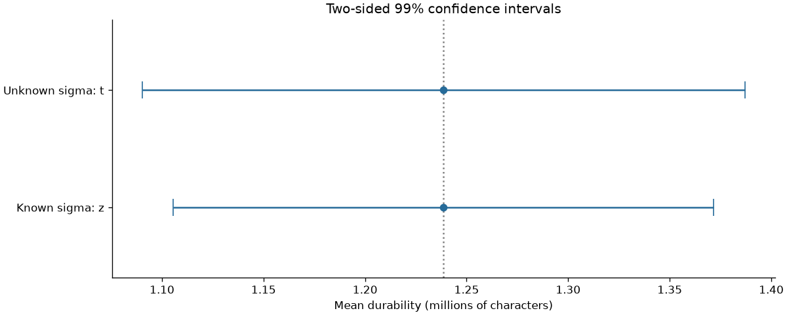

# Confidence intervals for print-head durability

[Read the completed notebook](notebooks/confidence_intervals.ipynb).

Fifteen print-heads have mean durability **1.238667 million characters** and sample standard deviation **0.193164 million**.

| Case | Method | 99% confidence interval (million characters) |
| --- | --- | --- |
| Unknown population SD | Student t, 14 degrees of freedom | 1.0902 to 1.3871 |
| Known population SD of 0.2 | Standard normal z | 1.1057 to 1.3717 |

The notebook explains critical values, standard errors, margins of error, assumptions, and frequentist interpretation. These are intervals for the population mean, not individual lifetimes. With n=15, population normality and independent representative observations matter. There is no supplied acceptance threshold for a product quality decision.

`data/` contains the 15 transcribed observations, `results/` contains full-precision calculations, `figures/` contains diagnostics and interval comparisons, and `src/analysis.py` reproduces the analysis. Install the repository requirements and run `python src/analysis.py` from this folder.
